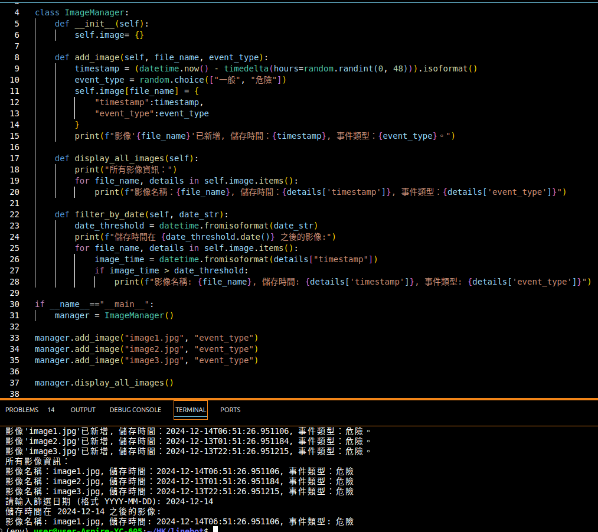
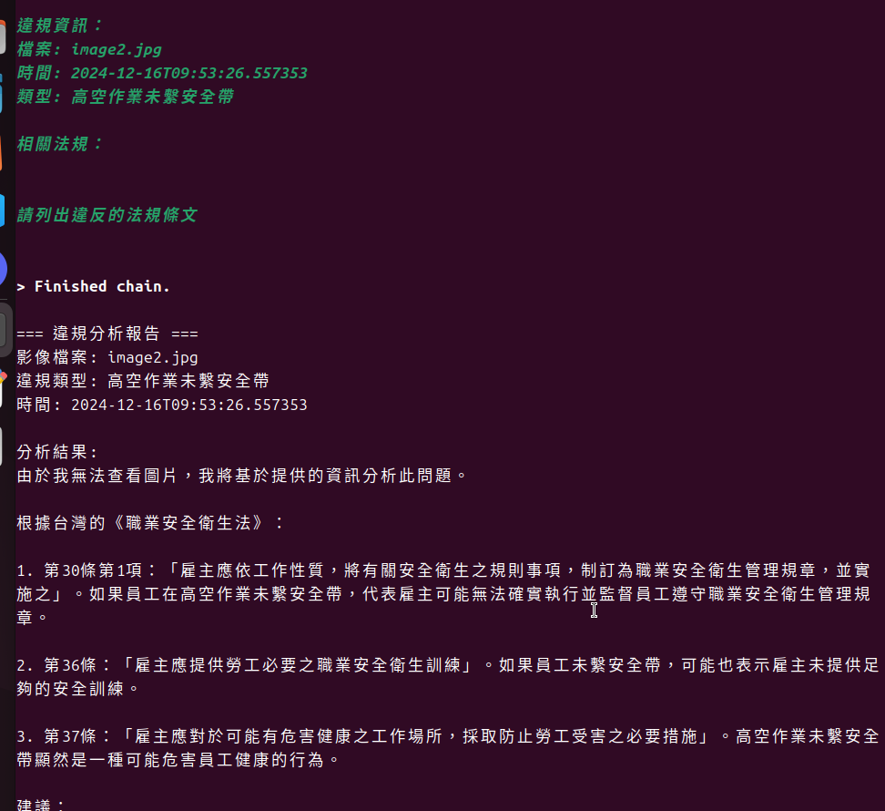

# 專案製作：工安影像管理與處理系統

分為四個段落：
1. 影像管理系統 - Image_managrment
2. 法規資料庫爬蟲 - Laws_crawlimg
3. LLM問答系統 - Laws_LLM
4. 影像處理 - Laws_mech

## 影像管理系統 - Image_managrment

運用虛假的影像資料，進行影像管理與分類，包含影像事件定義(一般、危險)、儲存時間。

建立搜尋欄位，便於篩選利特定日期之影像。

code：
```bash=
image_man.py
```

成果展示：


## 法規資料庫爬蟲 - Laws_crawlimg

由老師編寫的爬蟲程式。
從法規資料庫中，爬取法規，存入資料庫中。

code：
```bash=
# 連接資料庫
db_utils.py

# 爬蟲
scraper.py
```
## LLM問答系統 - Laws_LLM

爬取法規資料庫中的法規條文，並存入資料庫中。
運用虛假的影像資訊，讓AI根據資料庫內容進行違規法條判斷。

code：
```bash=
# 連接資料庫
db_utils.py

# 爬蟲
scraper.py

# LLM
AI_assisant.py
```

成果展示：


## 影像處理 - Laws_mech


ngrok 串接LineBot